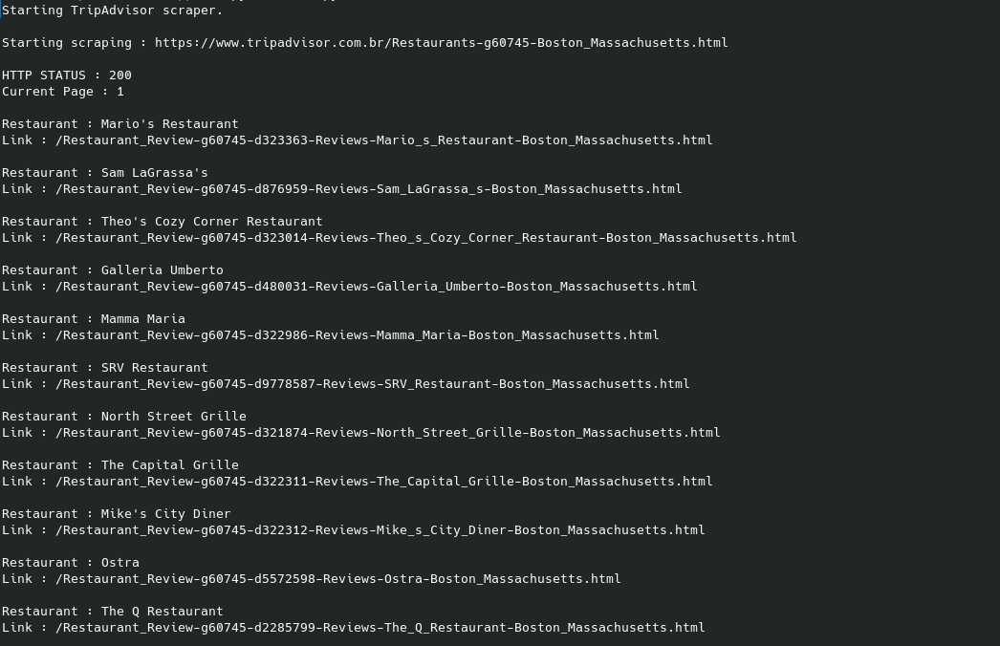
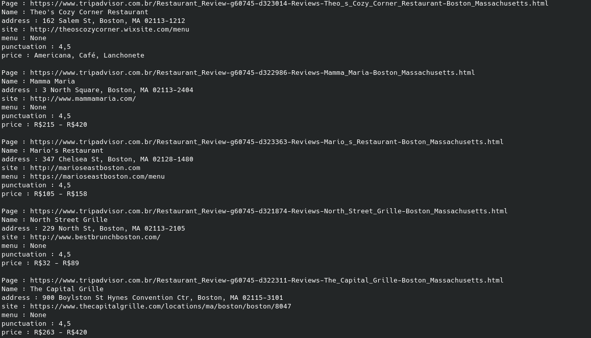

# TripAdvisor-Scraper
A web scraper for the site TripAdvisor.
Currently it only scrapes restaurant pages and informations of a search page

## USAGE

On main.py set SEARCH_PAGE to a search page for example : Restaurants-g60745-Boston_Massachusetts.html.
it will search for restaurants on https://www.tripadvisor.com.br/Restaurants-g60745-Boston_Massachusetts.html
Set MAX_SEARCH_PAGES to the amount of search pages it will iterate for

    Python main.py

It will scrape for all restaurant pages and then foreach page it will scrape the restaurant data

